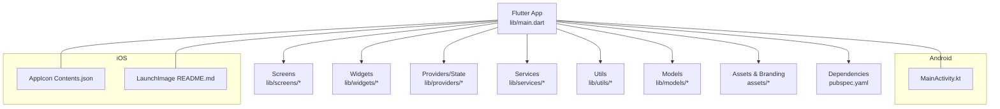
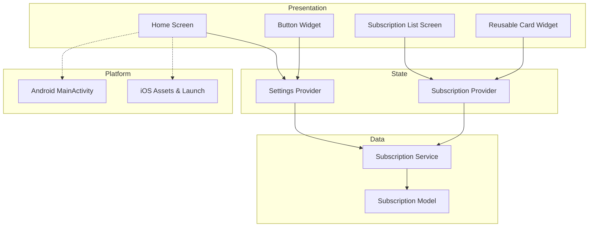
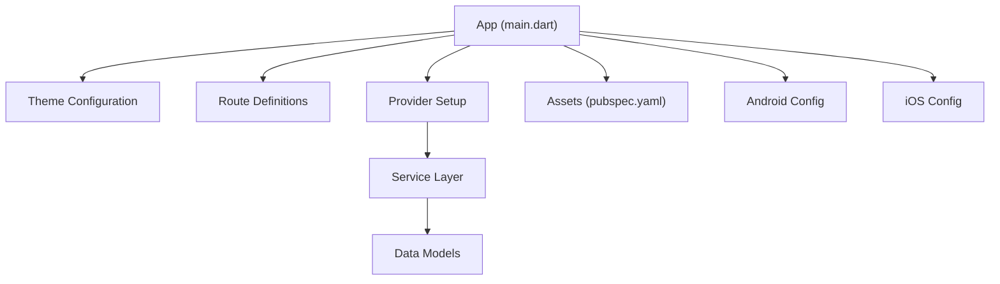

# UI/UX Components

<cite>
**Referenced Files in This Document**
- [README.md](file://README.md)
- [UI_GUIDE.md](file://docs/UI_GUIDE.md)
- [ARCHITECTURE.md](file://docs/ARCHITECTURE.md)
- [PROJECT_BRIEF.md](file://docs/PROJECT_BRIEF.md)
- [main.dart](file://lib/main.dart)
- [pubspec.yaml](file://pubspec.yaml)
- [MainActivity.kt](file://android/app/src/main/kotlin/br/com/assinaturasninja/assinaturas_ninja/MainActivity.kt)
- [AppIcon Contents.json](file://ios/Runner/Assets.xcassets/AppIcon.appiconset/Contents.json)
- [LaunchImage README.md](file://ios/Runner/Assets.xcassets/LaunchImage.imageset/README.md)
</cite>

## Table of Contents
1. [Introduction](#introduction)
2. [Project Structure](#project-structure)
3. [Core Components](#core-components)
4. [Architecture Overview](#architecture-overview)
5. [Detailed Component Analysis](#detailed-component-analysis)
6. [Dependency Analysis](#dependency-analysis)
7. [Performance Considerations](#performance-considerations)
8. [Troubleshooting Guide](#troubleshooting-guide)
9. [Conclusion](#conclusion)
10. [Appendices](#appendices)

## Introduction
This document explains the UI/UX architecture and component system for ASSINATURAS NINJA, focusing on screen organization, navigation patterns, widget composition strategy, theming, responsive design, platform-specific adaptations, accessibility, asset management, and branding. It provides guidelines for creating new screens, reusing widgets, maintaining design consistency, and integrating with Flutter’s Material Design principles.

## Project Structure
The Flutter application organizes UI-related code under lib/screens and lib/widgets, with shared configuration and assets referenced from pubspec.yaml and platform folders (Android and iOS). The entry point initializes the app theme and routes, while platform configurations define launch visuals and icons.

**Diagram sources**
- [main.dart](file://lib/main.dart)
- [pubspec.yaml](file://pubspec.yaml)
- [MainActivity.kt](file://android/app/src/main/kotlin/br/com/assinaturasninja/assinaturas_ninja/MainActivity.kt)
- [AppIcon Contents.json](file://ios/Runner/Assets.xcassets/AppIcon.appiconset/Contents.json)
- [LaunchImage README.md](file://ios/Runner/Assets.xcassets/LaunchImage.imageset/README.md)

**Section sources**
- [README.md](file://README.md)
- [UI_GUIDE.md](file://docs/UI_GUIDE.md)
- [ARCHITECTURE.md](file://docs/ARCHITECTURE.md)
- [PROJECT_BRIEF.md](file://docs/PROJECT_BRIEF.md)
- [main.dart](file://lib/main.dart)
- [pubspec.yaml](file://pubspec.yaml)

## Core Components
- Entry Point: Initializes the app, sets up global theme, routing, and providers.
- Screens: Feature-oriented pages organized by domain (e.g., subscriptions, settings).
- Widgets: Reusable UI building blocks following Material Design.
- Providers: State management layer to drive UI updates.
- Services: Business logic and data access used by screens and widgets.
- Utils: Shared helpers for formatting, validation, and UI constants.
- Models: Data structures consumed by providers and screens.

Guidelines:
- Keep screens thin; delegate business logic to providers/services.
- Compose complex UIs from small, reusable widgets.
- Centralize colors, typography, and spacing in a theme or constants file.
- Use Material components as the base for consistent look and feel.

**Section sources**
- [main.dart](file://lib/main.dart)
- [UI_GUIDE.md](file://docs/UI_GUIDE.md)
- [ARCHITECTURE.md](file://docs/ARCHITECTURE.md)

## Architecture Overview
The UI follows a layered approach:
- Presentation Layer: Screens and Widgets
- State Layer: Providers
- Domain/Data Layer: Services and Models
- Platform Integration: Android/iOS native hooks via plugins and platform configs

[No sources needed since this diagram shows conceptual workflow, not actual code structure]

## Detailed Component Analysis

### Screen Organization and Navigation
- Organize screens by feature directories under lib/screens.
- Use a central router to map named routes and handle deep links if required.
- Maintain a consistent top-level layout (AppBar, body, bottom navigation) across related screens.
- Prefer stack-based navigation for hierarchical flows and modal routes for dialogs and sheets.

Best practices:
- Keep route definitions centralized.
- Pass only necessary parameters between screens.
- Avoid tight coupling between screens; use providers for shared state.

**Section sources**
- [UI_GUIDE.md](file://docs/UI_GUIDE.md)
- [ARCHITECTURE.md](file://docs/ARCHITECTURE.md)

### Widget Composition Strategy
- Build small, focused widgets that encapsulate a single responsibility.
- Favor composition over inheritance; combine primitives to form complex UIs.
- Expose clear APIs via constructor parameters and callbacks.
- Use const constructors where possible to improve performance.

Accessibility:
- Provide semantic labels and semantics for custom widgets.
- Ensure sufficient contrast and scalable text support.

**Section sources**
- [UI_GUIDE.md](file://docs/UI_GUIDE.md)

### Theming System
- Define a centralized theme with color scheme, typography, and component themes.
- Support light/dark modes using ThemeData and platform brightness detection.
- Use theme tokens consistently across screens and widgets.

Responsive design:
- Leverage LayoutBuilder, MediaQuery, and flexible layouts to adapt to different screen sizes.
- Use adaptive widgets for platform differences when necessary.

**Section sources**
- [UI_GUIDE.md](file://docs/UI_GUIDE.md)
- [ARCHITECTURE.md](file://docs/ARCHITECTURE.md)

### Platform-Specific UI Adaptations
- Android: Customize splash and icon resources; ensure proper scaling and safe areas.
- iOS: Configure app icons and launch images; respect safe area insets.
- Use platform checks sparingly; prefer cross-platform solutions first.

**Section sources**
- [MainActivity.kt](file://android/app/src/main/kotlin/br/com/assinaturasninja/assinaturas_ninja/MainActivity.kt)
- [AppIcon Contents.json](file://ios/Runner/Assets.xcassets/AppIcon.appiconset/Contents.json)
- [LaunchImage README.md](file://ios/Runner/Assets.xcassets/LaunchImage.imageset/README.md)

### Asset Management and Branding
- Centralize assets in assets/* and declare them in pubspec.yaml.
- Follow naming conventions for icons and images; provide multiple resolutions.
- Use branded assets for logos and marketing materials; keep them versioned.

**Section sources**
- [pubspec.yaml](file://pubspec.yaml)
- [AppIcon Contents.json](file://ios/Runner/Assets.xcassets/AppIcon.appiconset/Contents.json)
- [LaunchImage README.md](file://ios/Runner/Assets.xcassets/LaunchImage.imageset/README.md)

### Creating New Screens
Steps:
1. Create a new file under lib/screens with a descriptive name.
2. Implement a StatelessWidget or StatefulWidget depending on local state needs.
3. Integrate with providers for shared state.
4. Register routes in the central router.
5. Add tests for critical user flows.

Consistency checklist:
- Follow existing layout patterns and spacing.
- Use theme tokens for colors and typography.
- Include accessibility labels and keyboard navigation support.

**Section sources**
- [UI_GUIDE.md](file://docs/UI_GUIDE.md)
- [ARCHITECTURE.md](file://docs/ARCHITECTURE.md)

### Custom Widget Creation and Styling
Approach:
- Start with Material primitives; wrap them to create domain-specific widgets.
- Parameterize behavior and appearance via constructor arguments.
- Encapsulate styling within the widget or theme tokens.

Integration with Material Design:
- Use Material components for buttons, cards, lists, and dialogs.
- Respect Material elevation, motion, and feedback guidelines.

**Section sources**
- [UI_GUIDE.md](file://docs/UI_GUIDE.md)

### Accessibility Features
Guidelines:
- Provide meaningful semantics for interactive elements.
- Ensure adequate color contrast ratios.
- Support dynamic text scaling and voiceover/talkback.
- Test with accessibility tools on both platforms.

**Section sources**
- [UI_GUIDE.md](file://docs/UI_GUIDE.md)

## Dependency Analysis
Key dependencies influencing UI:
- Flutter SDK and Material library for core UI components.
- State management packages (providers or similar) for reactive UI.
- Platform integrations for native features affecting UI (icons, launch screens).

**Diagram sources**
- [main.dart](file://lib/main.dart)
- [pubspec.yaml](file://pubspec.yaml)
- [MainActivity.kt](file://android/app/src/main/kotlin/br/com/assinaturasninja/assinaturas_ninja/MainActivity.kt)
- [AppIcon Contents.json](file://ios/Runner/Assets.xcassets/AppIcon.appiconset/Contents.json)

**Section sources**
- [pubspec.yaml](file://pubspec.yaml)
- [ARCHITECTURE.md](file://docs/ARCHITECTURE.md)

## Performance Considerations
- Prefer const widgets and avoid unnecessary rebuilds by scoping provider listeners.
- Use ListView.builder or GridView.builder for large lists.
- Defer heavy computations off the UI thread; cache results where appropriate.
- Optimize assets: compress images, use vector icons when possible.

[No sources needed since this section provides general guidance]

## Troubleshooting Guide
Common issues and resolutions:
- Theme inconsistencies: Verify all colors and typography are sourced from theme tokens.
- Navigation errors: Check route registration and parameter passing.
- Asset loading failures: Confirm assets are declared in pubspec.yaml and paths are correct.
- Platform-specific rendering: Validate Android/iOS resource configurations and safe area handling.

**Section sources**
- [UI_GUIDE.md](file://docs/UI_GUIDE.md)
- [pubspec.yaml](file://pubspec.yaml)

## Conclusion
ASSINATURAS NINJA’s UI/UX architecture emphasizes a clean separation of concerns, reusable widgets, and a strong theming system aligned with Material Design. By following the provided guidelines for screen creation, widget composition, responsive design, and accessibility, teams can maintain consistency and deliver high-quality experiences across Android and iOS.

[No sources needed since this section summarizes without analyzing specific files]

## Appendices

### Quick Reference: Guidelines Summary
- Screen organization: Feature-based directories, centralized routing.
- Widget strategy: Small, composable, well-parameterized components.
- Theming: Centralized tokens, light/dark mode support.
- Responsive design: Flexible layouts, platform-aware components.
- Accessibility: Semantics, contrast, scalable text.
- Assets: Declared in pubspec.yaml, consistent naming, multiple resolutions.

**Section sources**
- [UI_GUIDE.md](file://docs/UI_GUIDE.md)
- [ARCHITECTURE.md](file://docs/ARCHITECTURE.md)