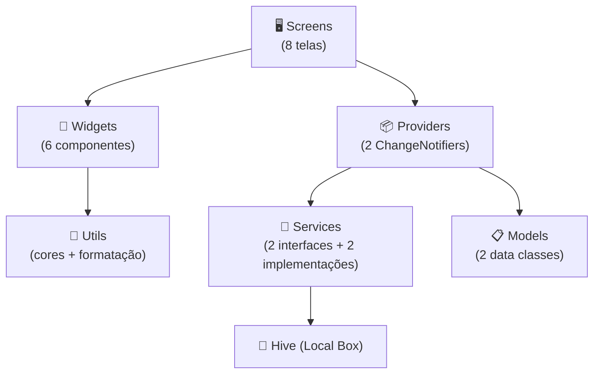
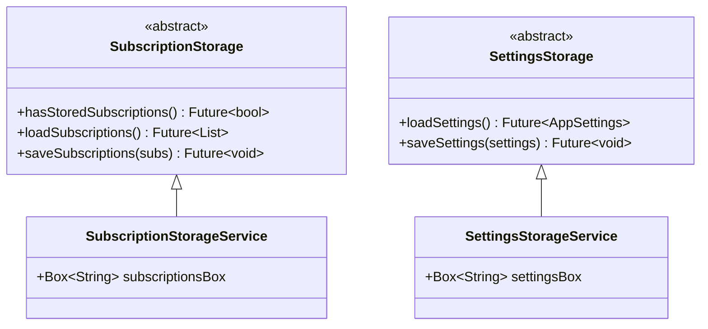
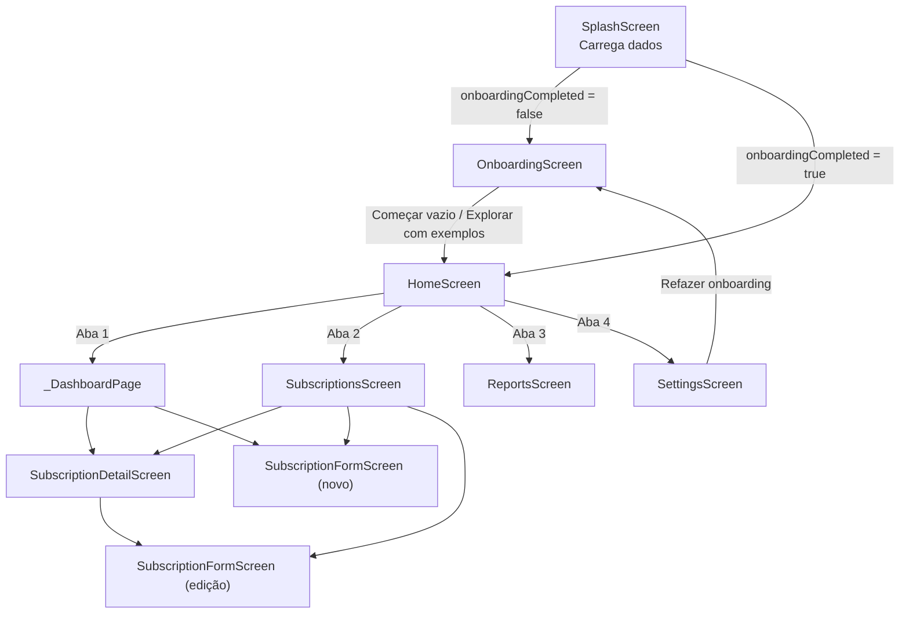
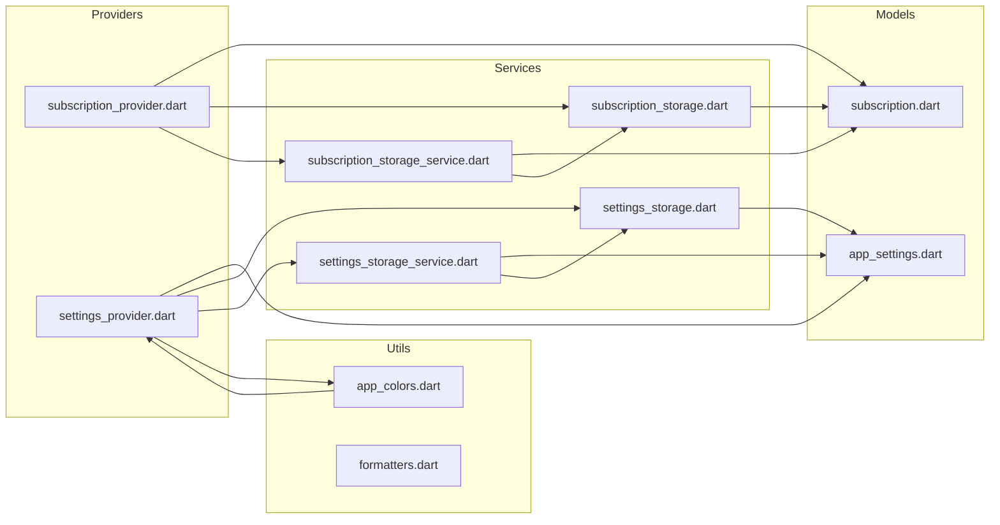

# Análise Arquitetural — Assinaturas Ninja

> Análise baseada na leitura direta de **todos os 28 arquivos** do projeto (`lib/`, `test/`, `pubspec.yaml`, assets).

---

## 1. Visão Geral do Projeto

| Atributo | Valor |
|---|---|
| **Framework** | Flutter / Dart |
| **SDK** | `^3.12.0` |
| **Versão** | 1.0.0+1 |
| **Plataformas** | Android (ícone configurado) + iOS (declarado) |
| **Modo** | 100% offline — sem backend, Firebase ou rede |
| **Persistência** | Hive (NoSQL local, JSON serializado) |
| **Estado** | Provider (ChangeNotifier) |
| **Dependências** | `provider`, `hive`, `hive_flutter`, `intl`, `uuid`, `cupertino_icons` |
| **Tema** | Dark-first com 5 temas pré-definidos + tema personalizado |

---

## 2. Árvore de Arquivos

```
lib/
├── main.dart                          (39 linhas)  — Entry point
├── models/
│   ├── subscription.dart              (130 linhas) — Modelo de assinatura
│   └── app_settings.dart              (71 linhas)  — Modelo de configurações
├── providers/
│   ├── subscription_provider.dart     (361 linhas) — Lógica de negócio + estado
│   └── settings_provider.dart         (125 linhas) — Lógica de configurações
├── services/
│   ├── subscription_storage.dart      (10 linhas)  — Interface abstrata
│   ├── subscription_storage_service.dart (41 linhas) — Implementação Hive Box
│   ├── settings_storage.dart          (8 linhas)   — Interface abstrata
│   └── settings_storage_service.dart  (29 linhas)  — Implementação Hive Box
├── utils/
│   ├── app_colors.dart                (204 linhas) — Sistema de temas
│   └── formatters.dart                (16 linhas)  — Formatação R$ e vencimento
├── widgets/
│   ├── brand_mark.dart                (85 linhas)  — Logo ninja (CustomPainter)
│   ├── category_icon.dart             (53 linhas)  — Ícone por categoria
│   ├── empty_state.dart               (52 linhas)  — Estado vazio
│   ├── status_chip.dart               (34 linhas)  — Badge de status
│   ├── subscription_card.dart         (99 linhas)  — Card da lista
│   └── summary_card.dart              (60 linhas)  — Card de resumo
├── screens/
│   ├── splash_screen.dart             (70 linhas)  — Carregamento inicial
│   ├── onboarding_screen.dart         (190 linhas) — Boas-vindas + setup
│   ├── home_screen.dart               (407 linhas) — Dashboard + navegação
│   ├── subscriptions_screen.dart      (223 linhas) — Lista completa
│   ├── subscription_form_screen.dart  (258 linhas) — Formulário CRUD
│   ├── subscription_detail_screen.dart(239 linhas) — Detalhes da assinatura
│   ├── reports_screen.dart            (301 linhas) — Relatórios e insights
│   └── settings_screen.dart           (566 linhas) — Ajustes e temas
test/
├── subscription_model_test.dart       (91 linhas)
├── subscription_provider_test.dart    (251 linhas)
├── settings_provider_test.dart        (58 linhas)
├── widgets_test.dart                  (55 linhas)
└── onboarding_screen_test.dart        (79 linhas)
assets/branding/
└── app_icon_master.png                (120 KB)
```

**Total:** ~3.415 linhas de código em `lib/` · ~534 linhas de testes

---

## 3. Arquitetura em Camadas



### Camada por camada:

### 3.1 Models — Domínio de Dados

| Classe | Arquivo | Campos | Responsabilidade |
|---|---|---|---|
| [Subscription](file:///c:/Users/202200007717/Desktop/ASSINATURAS%20NINJA/lib/models/subscription.dart) | `subscription.dart` | `id`, `name`, `price`, `dueDay`, `category`, `status`, `paymentMethod`, `notes`, `createdAt`, `updatedAt` | Imutável com `copyWith`, serialização `toMap`/`fromMap`, lógica de vencimento (`nextChargeDate`, `daysUntilDue`, `isDueToday`, `isDueSoon`) |
| [SubscriptionStatus](file:///c:/Users/202200007717/Desktop/ASSINATURAS%20NINJA/lib/models/subscription.dart#L1-L16) | `subscription.dart` | `active`, `paused`, `canceled` | Enum com label em pt-BR |
| [AppSettings](file:///c:/Users/202200007717/Desktop/ASSINATURAS%20NINJA/lib/models/app_settings.dart) | `app_settings.dart` | `onboardingCompleted`, `userName`, `monthlyBudget`, `themeId`, cores personalizadas | Imutável com `copyWith`, suporte a `clearMonthlyBudget` |

> [!TIP]
> Os models são **imutáveis** e não dependem de Flutter — puro Dart. Isso facilita testes unitários.

### 3.2 Providers — Gerenciamento de Estado

| Provider | Arquivo | Linhas | Escopo |
|---|---|---|---|
| [SubscriptionProvider](file:///c:/Users/202200007717/Desktop/ASSINATURAS%20NINJA/lib/providers/subscription_provider.dart) | `subscription_provider.dart` | 361 | CRUD, filtros, busca, ordenação, cálculos (total mensal, anual, categoria, mais cara, vencendo, economia), dados demo |
| [SettingsProvider](file:///c:/Users/202200007717/Desktop/ASSINATURAS%20NINJA/lib/providers/settings_provider.dart) | `settings_provider.dart` | 125 | Onboarding, perfil, temas (5 predefinidos + custom), reset |

**Injeção de dependência no provider:**
```dart
SubscriptionProvider({
  SubscriptionStorage? storage,  // permite FakeStorage nos testes
  DateTime Function()? now,       // permite controlar "agora" nos testes
  Uuid? uuid,                     // permite IDs previsíveis nos testes
})
```

> [!IMPORTANT]
> O `SubscriptionProvider` é o coração do app. Com 361 linhas, concentra **toda** a lógica de negócio — CRUD, filtros, cálculos de dashboard e relatórios. Isso é um ponto forte para um MVP, mas pode crescer.

### 3.3 Services — Persistência Local



**Estratégia de persistência:**
- Caixas localmente armazenadas do Hive (`subscriptions_box` e `settings_box`)
- Serialização JSON completa (`jsonEncode` / `jsonDecode`)
- Chaves: `subscriptions` (lista) e `app_settings` (objeto)
- Flag `subscriptions_initialized` para distinguir "nunca inicializado" de "lista vazia"

> [!NOTE]
> O padrão interface abstrata + implementação concreta possibilita **substituição total** por fakes nos testes — e é exatamente isso que os testes fazem.

### 3.4 Utils — Utilitários Transversais

| Arquivo | Conteúdo |
|---|---|
| [app_colors.dart](file:///c:/Users/202200007717/Desktop/ASSINATURAS%20NINJA/lib/utils/app_colors.dart) | Classe `AppTheme` (14 cores, `toThemeData()`), 5 temas (`ninjaDark`, `cyberpunk`, `forest`, `sunset`, `midnight`), classe `AppColors` com `of(context)` estático + fallbacks |
| [formatters.dart](file:///c:/Users/202200007717/Desktop/ASSINATURAS%20NINJA/lib/utils/formatters.dart) | `formatMoney(double)` → `R$ 39,90`, `dueLabel(int)` → `"vence hoje"` / `"em 3 dias"` |

### 3.5 Widgets — Componentes Reutilizáveis

| Widget | Uso | Destaque |
|---|---|---|
| [BrandMark](file:///c:/Users/202200007717/Desktop/ASSINATURAS%20NINJA/lib/widgets/brand_mark.dart) | Logo do app | **CustomPainter** que desenha uma máscara ninja com gradiente |
| [CategoryIcon](file:///c:/Users/202200007717/Desktop/ASSINATURAS%20NINJA/lib/widgets/category_icon.dart) | Ícone circular por categoria | Normalização de acentos para mapear categoria → ícone/cor |
| [EmptyState](file:///c:/Users/202200007717/Desktop/ASSINATURAS%20NINJA/lib/widgets/empty_state.dart) | Lista vazia | Botão CTA de adição |
| [StatusChip](file:///c:/Users/202200007717/Desktop/ASSINATURAS%20NINJA/lib/widgets/status_chip.dart) | Badge Ativa/Pausada/Cancelada | Cor dinâmica por status |
| [SubscriptionCard](file:///c:/Users/202200007717/Desktop/ASSINATURAS%20NINJA/lib/widgets/subscription_card.dart) | Item da lista de assinaturas | Borda vermelha quando vence hoje, PopupMenu com ações |
| [SummaryCard](file:///c:/Users/202200007717/Desktop/ASSINATURAS%20NINJA/lib/widgets/summary_card.dart) | Card genérico de métrica | Usado no dashboard para Ativas, Mais cara, Próxima |

### 3.6 Screens — Telas

| Tela | Tipo | Navegação | Funcionalidade Principal |
|---|---|---|---|
| [SplashScreen](file:///c:/Users/202200007717/Desktop/ASSINATURAS%20NINJA/lib/screens/splash_screen.dart) | `StatefulWidget` | → Onboarding OU Home | Carrega settings + subscriptions em paralelo |
| [OnboardingScreen](file:///c:/Users/202200007717/Desktop/ASSINATURAS%20NINJA/lib/screens/onboarding_screen.dart) | `StatefulWidget` | → Home | Nome, budget, "Começar vazio" vs "Explorar com exemplos" |
| [HomeScreen](file:///c:/Users/202200007717/Desktop/ASSINATURAS%20NINJA/lib/screens/home_screen.dart) | `StatefulWidget` | `IndexedStack` + `NavigationBar` | Shell com 4 abas: Dashboard, Assinaturas, Relatórios, Ajustes |
| [_DashboardPage](file:///c:/Users/202200007717/Desktop/ASSINATURAS%20NINJA/lib/screens/home_screen.dart#L73-L176) | Widget privado | — | Total mensal (card gradient), 3 SummaryCards, alerta de vencimento, lista de próximas cobranças |
| [SubscriptionsScreen](file:///c:/Users/202200007717/Desktop/ASSINATURAS%20NINJA/lib/screens/subscriptions_screen.dart) | `StatelessWidget` | push → Detail/Form | Busca, filtros (5 opções), ordenação (4 opções), lista com SubscriptionCard |
| [SubscriptionFormScreen](file:///c:/Users/202200007717/Desktop/ASSINATURAS%20NINJA/lib/screens/subscription_form_screen.dart) | `StatefulWidget` | pop | Formulário com validação (nome, preço > 0, dia 1-31), ChoiceChip categorias, SegmentedButton status |
| [SubscriptionDetailScreen](file:///c:/Users/202200007717/Desktop/ASSINATURAS%20NINJA/lib/screens/subscription_detail_screen.dart) | `StatelessWidget` | push → Form | Detalhes completos, botão pausar/ativar, excluir com confirmação |
| [ReportsScreen](file:///c:/Users/202200007717/Desktop/ASSINATURAS%20NINJA/lib/screens/reports_screen.dart) | `StatelessWidget` | — | Gasto anual, economia, barra de orçamento, barras por categoria, 3 insights dinâmicos |
| [SettingsScreen](file:///c:/Users/202200007717/Desktop/ASSINATURAS%20NINJA/lib/screens/settings_screen.dart) | `StatefulWidget` | push → Onboarding (reset) | Perfil, seletor de 5 temas + custom (4 cores), dados demo, limpar dados, refazer onboarding |

---

## 4. Fluxo de Navegação



---

## 5. Sistema de Temas

O app usa um sistema de temas sofisticado e **reativo**:

```
AppTheme (14 cores definidas)
  ├── background, backgroundSoft
  ├── card, cardLight
  ├── green (primária/sucesso)
  ├── cyan (secundária)
  ├── purple (acento/categoria)
  ├── yellow (pausado/alerta)
  ├── red (cancelado/perigo)
  ├── muted (texto secundário)
  ├── textPrimary
  └── border
```

**5 temas pré-definidos:** Ninja Dark (padrão) · Cyberpunk · Eco Floresta · Pôr do Sol · Midnight Blue

**Tema personalizado:** O usuário escolhe 4 cores (fundo, card, primária, secundária) via swatches circulares. As cores derivadas (`backgroundSoft`, `cardLight`, `border`) são calculadas automaticamente via HSL.

**Acesso:** `AppColors.of(context)` — wrapper estático sobre `Provider.of<SettingsProvider>`. Toda a UI reage a mudanças de tema em tempo real via `Consumer<SettingsProvider>` no `MaterialApp`.

---

## 6. Regras de Negócio Implementadas

| Regra | Onde é implementada | Verificado por teste? |
|---|---|---|
| Apenas assinaturas **ativas** entram no total mensal | [SubscriptionProvider.totalMonthly](file:///c:/Users/202200007717/Desktop/ASSINATURAS%20NINJA/lib/providers/subscription_provider.dart#L83-L86) | ✅ |
| Assinatura mais cara = ativa de maior preço | [SubscriptionProvider.mostExpensive](file:///c:/Users/202200007717/Desktop/ASSINATURAS%20NINJA/lib/providers/subscription_provider.dart#L120-L127) | ✅ |
| "Vencendo" = cobrança em ≤ 5 dias | [Subscription.isDueSoon](file:///c:/Users/202200007717/Desktop/ASSINATURAS%20NINJA/lib/models/subscription.dart#L89-L92) | ✅ |
| Dia 31 em meses curtos → clampa para último dia | [Subscription._safeDate](file:///c:/Users/202200007717/Desktop/ASSINATURAS%20NINJA/lib/models/subscription.dart#L124-L128) | Implícito |
| Preço > 0 obrigatório | [SubscriptionFormScreen validator](file:///c:/Users/202200007717/Desktop/ASSINATURAS%20NINJA/lib/screens/subscription_form_screen.dart#L113-L119) | — |
| Dia de vencimento entre 1 e 31 | [SubscriptionFormScreen validator](file:///c:/Users/202200007717/Desktop/ASSINATURAS%20NINJA/lib/screens/subscription_form_screen.dart#L130-L136) | — |
| Economia potencial = preço da mais cara ativa | [SubscriptionProvider.potentialMonthlySavings](file:///c:/Users/202200007717/Desktop/ASSINATURAS%20NINJA/lib/providers/subscription_provider.dart#L95) | ✅ |
| Dados demo = ação explícita do usuário | [OnboardingScreen "Explorar com exemplos"](file:///c:/Users/202200007717/Desktop/ASSINATURAS%20NINJA/lib/screens/onboarding_screen.dart#L95) + [SettingsScreen "Carregar demonstração"](file:///c:/Users/202200007717/Desktop/ASSINATURAS%20NINJA/lib/screens/settings_screen.dart#L232-L238) | ✅ |
| Total anual = total mensal × 12 | [SubscriptionProvider.annualActiveTotal](file:///c:/Users/202200007717/Desktop/ASSINATURAS%20NINJA/lib/providers/subscription_provider.dart#L93) | ✅ |
| Categoria com maior gasto | [SubscriptionProvider.topCategoryName](file:///c:/Users/202200007717/Desktop/ASSINATURAS%20NINJA/lib/providers/subscription_provider.dart#L106-L114) | ✅ |

---

## 7. Suíte de Testes

| Arquivo | Linhas | Tipo | O que testa |
|---|---|---|---|
| [subscription_model_test.dart](file:///c:/Users/202200007717/Desktop/ASSINATURAS%20NINJA/test/subscription_model_test.dart) | 91 | Unit | Cálculo de vencimento, isDueSoon, serialização toMap/fromMap |
| [subscription_provider_test.dart](file:///c:/Users/202200007717/Desktop/ASSINATURAS%20NINJA/test/subscription_provider_test.dart) | 251 | Unit | Totais, mais cara, ordenação, CRUD, filtros, busca, categorias, insights, dados demo |
| [settings_provider_test.dart](file:///c:/Users/202200007717/Desktop/ASSINATURAS%20NINJA/test/settings_provider_test.dart) | 58 | Unit | Carregamento default, onboarding, reset |
| [widgets_test.dart](file:///c:/Users/202200007717/Desktop/ASSINATURAS%20NINJA/test/widgets_test.dart) | 55 | Widget | EmptyState text, StatusChip label |
| [onboarding_screen_test.dart](file:///c:/Users/202200007717/Desktop/ASSINATURAS%20NINJA/test/onboarding_screen_test.dart) | 79 | Widget | Tela de onboarding renderiza, "Começar vazio" funciona |

**Padrão de teste:** Fakes injetados via construtor — `FakeSubscriptionStorage`, `FakeSettingsStorage`. Clock controlado via `now: () => DateTime(2026, 5, 12)`.

> [!TIP]
> A cobertura dos **cálculos de negócio** é boa (totais, filtros, categorias, insights). Lacunas estão na validação de formulários e no fluxo completo de telas.

---

## 8. Métricas Resumidas

```
┌──────────────────┬────────┬────────┐
│ Camada           │ Arquivos │ Linhas │
├──────────────────┼────────┼────────┤
│ Models           │    2   │   201  │
│ Providers        │    2   │   486  │
│ Services         │    4   │    88  │
│ Utils            │    2   │   220  │
│ Widgets          │    6   │   383  │
│ Screens          │    8   │ 2.037  │
│ Entry (main)     │    1   │    39  │
├──────────────────┼────────┼────────┤
│ Total lib/       │   25   │ 3.454  │
│ Total test/      │    5   │   534  │
│ Total geral      │   30   │ 3.988  │
└──────────────────┴────────┴────────┘
```

---

## 9. Diagrama de Dependências entre Arquivos



> [!NOTE]
> Existe uma **dependência circular conceitual** entre `app_colors.dart` e `settings_provider.dart`: `AppColors.of(context)` lê do `SettingsProvider`, enquanto `SettingsProvider.activeTheme` retorna um `AppTheme` definido em `app_colors.dart`. Na prática funciona porque Flutter resolve isso via Provider tree, mas é algo a estar ciente.
