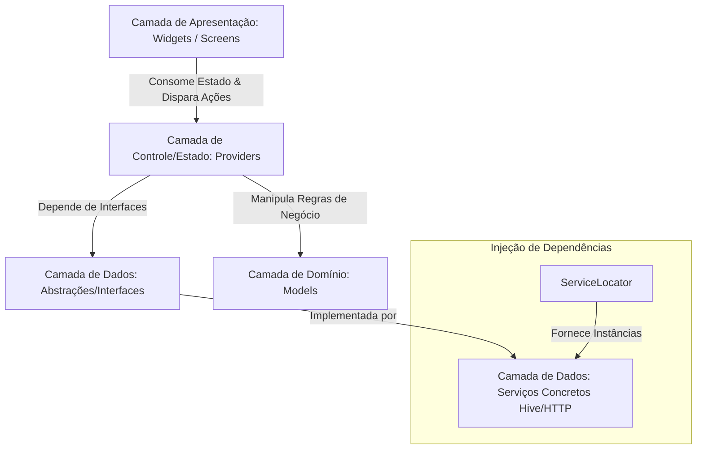

# Arquitetura do Projeto — Assinaturas Ninja 🥷📱

Este documento descreve detalhadamente a arquitetura de software, padrões de design, injeção de dependências e fluxo de dados do aplicativo **Assinaturas Ninja**. O projeto foi concebido para ser uma aplicação móvel **offline-first**, focada na simplicidade, resiliência de dados locais e facilidade de manutenção.

---

## 1. Visão Geral da Arquitetura

O aplicativo adota uma arquitetura em camadas inspirada nos princípios de Clean Architecture e adaptada para o ecossistema Flutter utilizando o padrão **MVC/MVP reativo** com gerenciamento de estado via **Provider**.

A estrutura é dividida em quatro camadas lógicas fundamentais:



### Camadas do Projeto:
1. **Apresentação (UI/Views):** Contém os componentes visuais do Flutter (`lib/screens/` e `lib/widgets/`). Esta camada é inteiramente reativa e livre de lógica de negócios.
2. **Gerenciamento de Estado / Apresentadores (Controllers/Presenters):** Implementada pelos Providers (`lib/providers/`). Eles expõem o estado da aplicação para a interface do usuário e orquestram as mutações e chamadas de serviços.
3. **Domínio (Entities/Models):** Contém as entidades principais de dados (`lib/models/`), que encapsulam regras puras de negócio (como cálculo de vencimentos de assinaturas).
4. **Dados (Data/Services):** Contém as abstrações e implementações concretas de serviços de armazenamento e comunicação com APIs (`lib/services/`).

---

## 2. Padrão de Apresentação e Estado: MVC / MVP Reativo com Provider

O Assinaturas Ninja utiliza o pacote `provider` combinado com `ChangeNotifier` para realizar a ponte entre a interface do usuário e a lógica de negócios. Esse fluxo atua de forma análoga a uma variação moderna do **MVP (Model-View-Presenter)** ou **MVC (Model-View-Controller)**:

### 2.1. A View (Telas e Componentes)
Representada pelos Widgets e Screens do Flutter. Suas únicas responsabilidades são:
- Renderizar a interface de usuário baseada no estado atual fornecido pelos Providers.
- Capturar eventos do usuário (toques, digitação) e encaminhá-los diretamente para os métodos dos Providers.
- Consumir dados de forma otimizada usando `context.watch<T>()` ou o widget `Consumer<T>`, e delegar ações sem escutar mudanças usando `context.read<T>()`.

### 2.2. O Controller / Presenter (Providers)
Representado pelas classes que estendem `ChangeNotifier` em `lib/providers/`:
- **`SubscriptionProvider`**: Controla o estado de carregamento, filtros (`SubscriptionFilter`), ordenação (`SubscriptionSort`), busca de assinaturas e cálculos financeiros dinâmicos (gastos mensais, projeção anual, savings potenciais).
- **`SettingsProvider`**: Controla o estado de configuração do usuário (`AppSettings`), gerencia o tema ativo e a conversão de moedas.
- **`CurrencyProvider`**: Gerencia a busca de taxas de câmbio (USD/BRL) e rentabilidade Selic junto às APIs externas.

Esses controladores mantêm as regras de fluxo (ex: "carregar dados, salvar localmente, recalcular e notificar a interface").

### 2.3. A Model (Entidades Imutáveis)
Representada pelas classes de dados em `lib/models/`:
- **`Subscription`**: Um modelo puramente imutável (`const`) com construtores e utilitários como `copyWith`. Contém as regras de cálculo temporal de cobranças (`nextChargeDate()`, `daysUntilDue()`, `isDueSoon()`).
- **`AppSettings`**: Classe imutável para preferências do usuário (tema ativo, limite de orçamento, moeda padrão, dados de onboarding).

#### Exemplo de Regra de Negócio Pura na Model (`Subscription`):
```dart
// Garante o fechamento correto do mês (clamp) para vencimentos inválidos em meses curtos (ex: dia 31 em fevereiro)
static DateTime _safeDate(int year, int month, int day) {
  final lastDayOfMonth = DateTime(year, month + 1, 0).day;
  return DateTime(year, month, day > lastDayOfMonth ? lastDayOfMonth : day);
}
```

---

## 3. Injeção de Dependências e o Padrão Service Locator

Para manter o acoplamento baixo e facilitar a escrita de testes automatizados, o projeto adota um padrão de **Injeção de Dependências (DI)** por construtor, auxiliado por um **Service Locator** estático.

### 3.1. O Container `ServiceLocator`
Localizado em `lib/services/service_locator.dart`, o localizador gerencia o ciclo de vida e a instanciação dos serviços e repositórios do aplicativo:

```dart
abstract class ServiceLocator {
  static SubscriptionStorage subscriptionStorage() => SubscriptionStorageService();
  static SettingsStorage settingsStorage() => SettingsStorageService();
}
```

### 3.2. Injeção via Construtor nos Providers
Em vez de instanciar serviços concretos diretamente em seu código interno, os Providers declaram suas dependências no construtor. Isso permite injetar Fakes ou Mocks em ambientes de teste.

```dart
class SubscriptionProvider extends ChangeNotifier {
  final SubscriptionStorage _storage;
  final DateTime Function() _now;
  final Uuid _uuid;

  SubscriptionProvider({
    SubscriptionStorage? storage,
    DateTime Function()? now,
    Uuid? uuid,
  })  : _storage = storage ?? ServiceLocator.subscriptionStorage(),
        _now = now ?? DateTime.now,
        _uuid = uuid ?? const Uuid();
  
  // ... resto da lógica
}
```

### 3.3. Configuração dos Providers na Raiz (`main.dart`)
Os Providers são instanciados e injetados na árvore de widgets usando `MultiProvider` no arquivo `lib/main.dart`:

```dart
runApp(
  MultiProvider(
    providers: [
      ChangeNotifierProvider(
        create: (_) => SubscriptionProvider()..loadSubscriptions(),
      ),
      ChangeNotifierProvider(
        create: (_) => SettingsProvider()..loadSettings(),
      ),
      ChangeNotifierProvider(
        create: (_) => CurrencyProvider(),
      ),
    ],
    child: const AssinaturasNinjaApp(),
  ),
);
```

---

## 4. Persistência de Dados e Resiliência (Camada de Dados)

O Assinaturas Ninja armazena todos os seus dados localmente na memória do dispositivo de forma persistente utilizando o **Hive**.

### 4.1. Abstração de Armazenamento (Repository Pattern)
A persistência segue o padrão de repositório, separando a definição da interface de armazenamento da tecnologia de banco de dados escolhida:

```dart
abstract class SubscriptionStorage {
  Future<bool> hasStoredSubscriptions();
  Future<List<Subscription>> loadSubscriptions();
  Future<void> saveSubscriptions(List<Subscription> subscriptions);
}
```

A classe `SubscriptionStorageService` implementa essa interface utilizando caixas (`boxes`) do Hive.

### 4.2. Estratégia de Serialização Resiliente (JSON Manual)
Para evitar problemas decorrentes de mudanças em geradores de código de banco de dados (como Hive Adapters gerados por build_runner), as informações são persistidas como strings serializadas em formato **JSON**:

- O box local grava chaves primitivas (ex: `subscriptions` e `app_settings`).
- O parsing e desserialização ocorrem manualmente nos métodos `fromMap()` e `toMap()` dos modelos.

### 4.3. Tratamento de Erros e Autorrecuperação
Caso ocorra corrupção de dados (por exemplo, falha de parser no JSON devido a uma alteração de tipo de dado ou fechamento inesperado do app), o sistema implementa autorrecuperação inteligente:

```dart
@override
Future<List<Subscription>> loadSubscriptions() async {
  try {
    final rawJson = _box.get(_key);
    if (rawJson == null) return [];
    final List<dynamic> list = jsonDecode(rawJson);
    return list.map((m) => Subscription.fromMap(m)).toList();
  } catch (e) {
    // Se houver corrupção, limpa a chave local e grava o estado inicial padrão
    await _box.delete(_key);
    return [];
  }
}
```

---

## 5. Fluxo de Dados e Ciclo de Vida da Aplicação

### 5.1. Inicialização e Splash Screen
1. `main()` inicializa o Flutter, configura a localidade regional (`pt_BR`) e abre as caixas físicas do Hive de forma assíncrona.
2. A `SplashScreen` é exibida.
3. Utilizando `Future.wait`, os Providers carregam concorrentemente as configurações locais (`SettingsProvider.loadSettings()`) e a lista de assinaturas (`SubscriptionProvider.loadSubscriptions()`).
4. Se o Onboarding já foi completado pelo usuário, o app navega para a rota `/home`, caso contrário, redireciona para `/onboarding`.

### 5.2. Fluxo Típico de Alteração de Dados (Ex: Adicionar Assinatura)
1. **View:** O usuário preenche o formulário na `SubscriptionFormScreen` e clica em salvar.
2. **View -> Controller:** A tela chama `context.read<SubscriptionProvider>().addSubscription(...)`.
3. **Controller:** O Provider instancia uma nova entidade imutável `Subscription` com os parâmetros validados e adiciona à sua lista interna na memória.
4. **Controller -> Repository:** O Provider invoca o método privado `_saveAndNotify()`, que aciona o serviço `SubscriptionStorage.saveSubscriptions(_subscriptions)`.
5. **Repository (Hive):** O serviço serializa a lista em JSON e grava fisicamente no armazenamento.
6. **Controller -> View (Reatividade):** O Provider executa `notifyListeners()`, fazendo com que todas as telas e widgets que escutam a lista de assinaturas (como o dashboard e a lista geral) se redesenhem automaticamente com as informações atualizadas.

---

## 6. Integração com APIs REST Externas (Princípio Offline-First)

Embora o aplicativo funcione de forma independente offline com persistência local, ele se conecta a duas **APIs REST** externas via requisições HTTP (`GET`) para enriquecer a experiência com dados financeiros dinâmicos:

1. **AwesomeAPI (Taxa de Câmbio USD/BRL):**
   - **Endpoint:** `https://economia.awesomeapi.com.br/json/last/USD-BRL`
   - **Retorno:** Payload JSON com o dicionário chave-valor `USDBRL` contendo a cotação atual sob o campo `bid` (string).
   - **Objetivo:** Realizar a conversão dinâmica dos gastos e projeções para dólar americano (`USD`) se essa for a preferência de exibição selecionada pelo usuário.

2. **API do Banco Central do Brasil (SGS - Sistema Gerenciador de Séries Temporais):**
   - **Endpoint:** `https://api.bcb.gov.br/dados/serie/bcdata.sgs.432/dados/ultimos/1?formato=json` (Série 432 - Meta Selic anualizada % a.a.).
   - **Retorno:** Array JSON no formato `[{"data": "dd/MM/yyyy", "valor": "XX.XX"}]`.
   - **Objetivo:** Obter a taxa básica de juros atualizada e calcular a projeção de economia/rendimento Selic acumulado em 12 meses no dashboard.

### Resiliência e Degradação Graciosa:
- As requisições são implementadas no serviço `CurrencyApiService` utilizando chamadas assíncronas do pacote `http` e possuem um timeout estrito de **5 segundos**.
- Caso ocorra falha de conexão (offline), latência excessiva (timeout) ou erro na desserialização do JSON, a exceção é capturada de forma segura e o método retorna `null`.
- O aplicativo trata os retornos nulos de forma robusta na UI: a simulação de investimento com a Selic é omitida do painel de insights e a conversão de câmbio falha graciosamente mantendo os valores originais, evitando telas de erro ou travamentos.

---

## 7. Estratégia de Testabilidade

Graças ao desacoplamento promovido pelo uso de interfaces (`Storage`) e injeção de dependências no construtor de Providers, o aplicativo possui uma estratégia de testes robusta baseada em três níveis:

- **Testes Unitários (`test/models/` e `test/providers/`):** Garantem que as lógicas de cálculo de datas de cobrança de assinaturas funcionem perfeitamente em cenários limite (dias 28, 29, 30 e 31) e que as operações de CRUD do Provider atualizem o estado de maneira correta.
- **Testes de Widget (`test/widgets/`):** Verificam a renderização e interatividade de componentes chave (como onboarding e cards) injetando controladores mockados.
- **Testes de Integração:** Validam o fluxo completo de cadastro, edição e exclusão simulando a experiência direta do usuário.
